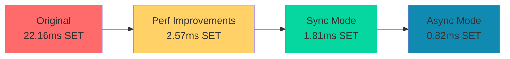

# 🚀 git-mem Benchmark Suite

<div align="center">


**Comprehensive performance benchmarking for git-mem MCP memory server**
*Compare git-mem against engram and track performance evolution*

[📊 View Latest Results](#-latest-results) • [⚡ Quick Start](#-quick-start) • [📈 Visualizations](#-visualizations) • [🔍 Methodology](#-methodology)

</div>

---

## 📋 Table of Contents

- [✨ Overview](#-overview)
- [🚀 Key Findings](#-key-findings)
- [📊 Latest Results](#-latest-results)
- [⚡ Quick Start](#-quick-start)
- [🔧 Installation](#-installation)
- [📈 Visualizations](#-visualizations)
- [🔍 Methodology](#-methodology)
- [📁 Repository Structure](#-repository-structure)
- [🤝 Contributing](#-contributing)
- [📄 License](#-license)

---

## ✨ Overview

This benchmark suite provides comprehensive performance analysis of **git-mem**, a Git-backed MCP memory server, compared against **engram**, a SQLite-based MCP memory solution. The benchmark tracks performance evolution across git-mem versions and evaluates the impact of new features like **async writes**.

<div align="center">

### 📊 Performance Comparison Summary

| Server | SET Latency | GET Latency | DELETE Latency | Search Latency |
|--------|-------------|-------------|----------------|----------------|
| git-mem (sync) | 1.81 ms | 0.36 ms | 1.21 ms | ~4.5 ms |
| **git-mem (async)** | **0.82 ms** | 0.28 ms | **0.36 ms** | ~4.6 ms |
| **engram** | **0.57 ms** | **0.18 ms** | **0.18 ms** | ~8.2 ms |

</div>

## 🚀 Key Findings

### 🎯 **Major Performance Improvements**

1. **30x SET Speedup**: git-mem SET operations improved from **22.16ms** (original) to **0.82ms** (async)
2. **Async Writes Impact**: 2.5x faster SET operations with `-async-writes` enabled
3. **Competitive Search**: git-mem search is **1.8x faster** than engram
4. **Reduced Gap**: git-mem with async is now **1.4x-2.0x** slower than engram (vs 5.4x-6.7x slower in sync mode)

### 📈 **Performance Evolution Timeline**



## 📊 Latest Results

### Operation Performance Comparison

| Operation | git-mem (sync) | git-mem (async) | engram | Async Improvement |
|-----------|----------------|-----------------|--------|-------------------|
| **SET** | 1.81 ms | **0.82 ms** | 0.57 ms | **2.2x faster** |
| **GET** | 0.36 ms | 0.28 ms | **0.18 ms** | 1.3x faster |
| **DELETE** | 1.21 ms | **0.36 ms** | 0.18 ms | **3.4x faster** |
| **LIST** | 0.43 ms | 0.23 ms | **0.12 ms** | 1.9x faster |
| **SEARCH** | **4.35 ms** | **4.61 ms** | 8.46 ms | **git-mem wins** |

### Throughput Comparison (ops/sec)

<div align="center">

```bash
SET Throughput:
├─ git-mem-sync:    553 ops/sec
├─ git-mem-async:  1,366 ops/sec  (+147%)
└─ engram:         1,740 ops/sec

GET Throughput:
├─ git-mem-sync:  2,808 ops/sec
├─ git-mem-async: 3,627 ops/sec  (+29%)
└─ engram:        5,484 ops/sec
```

</div>

## ⚡ Quick Start

### Clone and Run Benchmarks

```bash
# Clone the repository
git clone https://github.com/imran31415/git-mem-bench.git
cd git-mem-bench

# Run setup
./setup.sh

# Run comprehensive benchmark
python3 run_benchmark.py

# Run async writes comparison
python3 run_async_benchmark.py
```

### View Results

```bash
# Generate interactive HTML report
python3 create_html_report.py
open results/visualizations/benchmark_report.html

# Generate text visualizations
python3 text_visualizations.py

# Export to CSV for spreadsheet analysis
python3 create_csv_exports.py
```

## 🔧 Installation

### Prerequisites

- **Python 3.10+**
- **Go 1.22+** (for installing MCP servers)
- **git-mem**: `go install github.com/imran31415/git-mem/cmd/git-mem@latest`
- **engram**: `go install github.com/Gentleman-Programming/engram/cmd/engram@latest`

### Automated Setup

```bash
# Run the setup script
./setup.sh

# Expected output:
# ✓ git-mem is installed
# ✓ engram is installed
# ✓ Python virtual environment created
# ✓ Required packages installed
```

### Manual Installation

```bash
# Install Python dependencies
pip install psutil pandas matplotlib seaborn

# Install MCP servers
go install github.com/imran31415/git-mem/cmd/git-mem@latest
go install github.com/Gentleman-Programming/engram/cmd/engram@latest

# Add Go binaries to PATH
export PATH=$PATH:$(go env GOPATH)/bin
```

## 📈 Visualizations

### Interactive HTML Report

<div align="center">


*Color-coded performance tables, evolution timeline, and comparison charts*

</div>

Generate with: `python3 create_html_report.py`

### Text-Based Visualizations

```bash
# Generate ASCII performance charts
python3 text_visualizations.py

# Example output:
==============================================================
               OPERATION LATENCY (ms) - Lower is better              
==============================================================

git-mem-sync:
  set            1.81 ██████████████████████████████████████████████████
  get            0.36 ████████
  delete         1.21 ████████████████████████
  list           0.43 █████████

git-mem-async:
  set            0.82 ████████████████
  get            0.28 ███████
  delete         0.36 ████████
  list           0.23 █████
```

### CSV Export for Spreadsheet Analysis

```bash
# Create Excel/Sheets compatible exports
python3 create_csv_exports.py

# Files created:
# • detailed_results_[timestamp].csv
# • comparison_summary_[timestamp].csv
# • performance_evolution_[timestamp].csv
```

## 🔍 Methodology

### Benchmark Configuration

- **Test Data**: 100 items with small/medium/large values
- **Operations**: 50 SET/GET/DELETE/LIST operations each
- **Concurrency**: 3 simultaneous clients
- **Search**: 4 query patterns (test, item, document, benchmark)
- **Environment**: Ubuntu 24.04, 4 vCPUs, 8GB RAM

### Test Categories

1. **Basic CRUD Operations**
   - SET: Create/update memory entries
   - GET: Retrieve existing entries
   - DELETE: Remove entries
   - LIST: List all keys with optional prefix filtering

2. **Search Performance**
   - Full-text search across keys, values, and tags
   - Multiple query patterns
   - Case-insensitive substring matching

3. **Concurrent Access**
   - Multiple simultaneous clients
   - Mixed read/write workloads
   - Conflict scenario testing

4. **Feature Testing**
   - Tool discovery and availability
   - Special features (git-mem code mode, engram FTS5)
   - Configuration flexibility

### Measurement Approach

- **Latency**: `time.perf_counter()` with nanosecond precision
- **Throughput**: Operations per second calculation
- **Success Rate**: Error tracking and recovery
- **Statistical Analysis**: Mean, median, std dev, percentiles
- **Resource Monitoring**: Memory, CPU, disk I/O (when available)

## 📁 Repository Structure

```
git-mem-bench/
├── 📄 README.md                  # This documentation
├── ⚡ setup.sh                   # Automated setup script
├── 📋 requirements.txt          # Python dependencies
├── 📊 run_benchmark.py          # Main benchmark runner
├── 🔄 run_async_benchmark.py    # Async writes comparison
├── 📈 create_visualizations.py  # Graphical visualization
├── 📱 create_html_report.py     # HTML report generator
├── 📊 create_csv_exports.py     # CSV data export
├── 📋 text_visualizations.py    # Text-based visualizations
├── ⚙️ config/
│   └── benchmark_config.json    # Server configurations
├── 🧪 test_harness/
│   ├── mcp_client.py           # Generic MCP client wrapper
│   └── benchmark_suite.py      # Benchmark test suite
├── 📊 results/
│   ├── 📁 raw/                 # Raw benchmark data (JSON)
│   ├── 📁 processed/           # Aggregated analysis data
│   └── 📁 visualizations/      # Charts, reports, exports
└── 📚 docs/
    └── 📁 final_report/        # Detailed analysis reports
```

## 🤝 Contributing

We welcome contributions to improve the benchmark suite!

### How to Contribute

1. **Fork the repository**
2. **Create a feature branch**
   ```bash
   git checkout -b feature/improvement-name
   ```
3. **Add new MCP servers** to `config/benchmark_config.json`
4. **Implement new test scenarios** in `test_harness/benchmark_suite.py`
5. **Submit a pull request** with clear description

### Adding New MCP Servers

1. Install the MCP server
2. Add configuration to `config/benchmark_config.json`:
   ```json
   "new-server": {
     "command": ["server-binary", "args"],
     "enabled": true,
     "description": "New MCP memory server"
   }
   ```
3. Test with benchmark framework
4. Run comparison analysis

### Future Enhancements

- [ ] Add more MCP memory solutions (SimpleMem, codebase-memory-mcp)
- [ ] Scale testing with 10k+ entries
- [ ] Resource monitoring with psutil
- [ ] Automated CI/CD benchmarking pipeline
- [ ] Docker container for consistent environment

## 📄 License

This benchmark suite is open source and available under the **MIT License**.

```
MIT License

Copyright (c) 2026 git-mem Benchmark Suite

Permission is hereby granted, free of charge, to any person obtaining a copy
of this software and associated documentation files (the "Software"), to deal
in the Software without restriction, including without limitation the rights
to use, copy, modify, merge, publish, distribute, sublicense, and/or sell
copies of the Software, and to permit persons to whom the Software is
furnished to do so, subject to the following conditions:

The above copyright notice and this permission notice shall be included in all
copies or substantial portions of the Software.
```

---

<div align="center">

### 🎯 **Benchmark-Driven Development**

*This benchmark suite helps developers make informed decisions about MCP memory solutions based on real performance data.*

**Maintained by the git-mem community • [Report Issues](https://github.com/imran31415/git-mem-bench/issues)**

[⬆ Back to Top](#-git-mem-benchmark-suite)

</div>